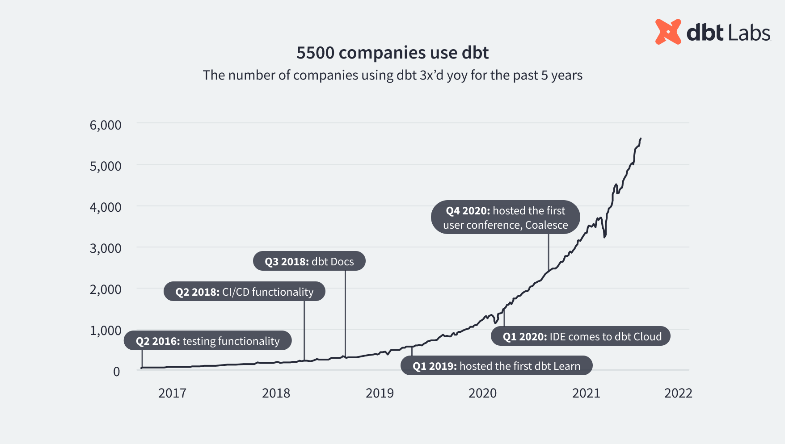
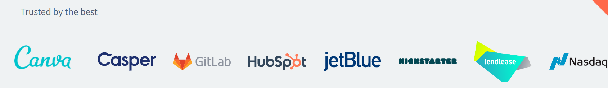
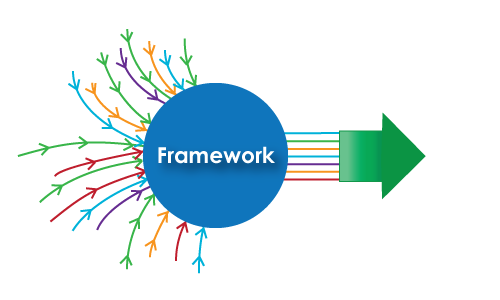
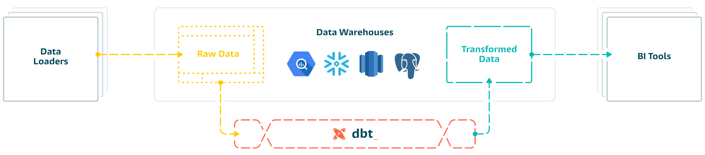
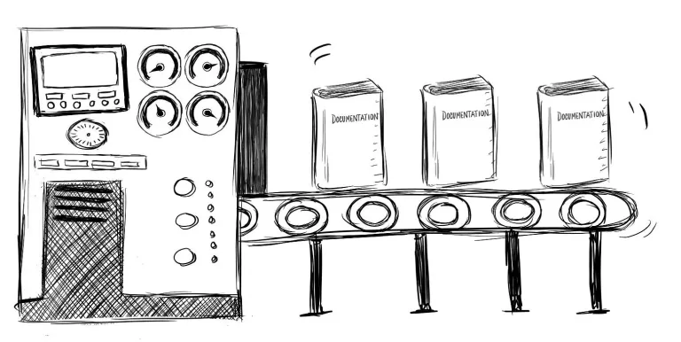
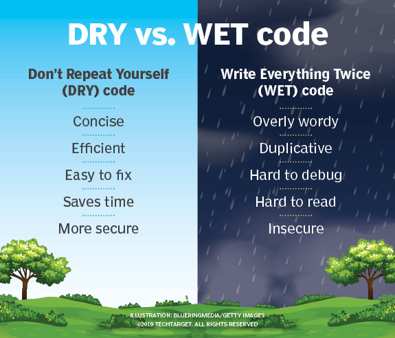
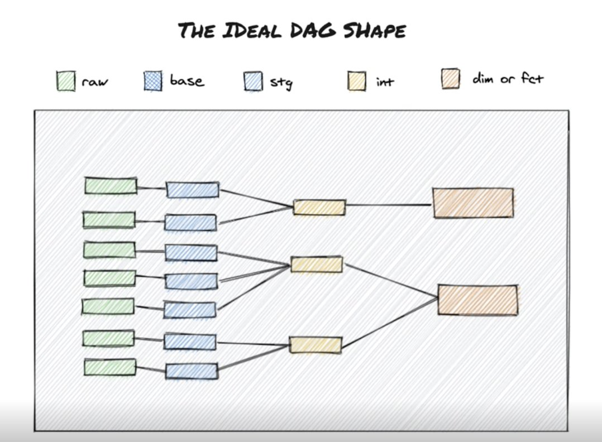
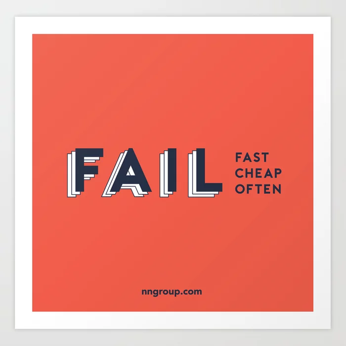
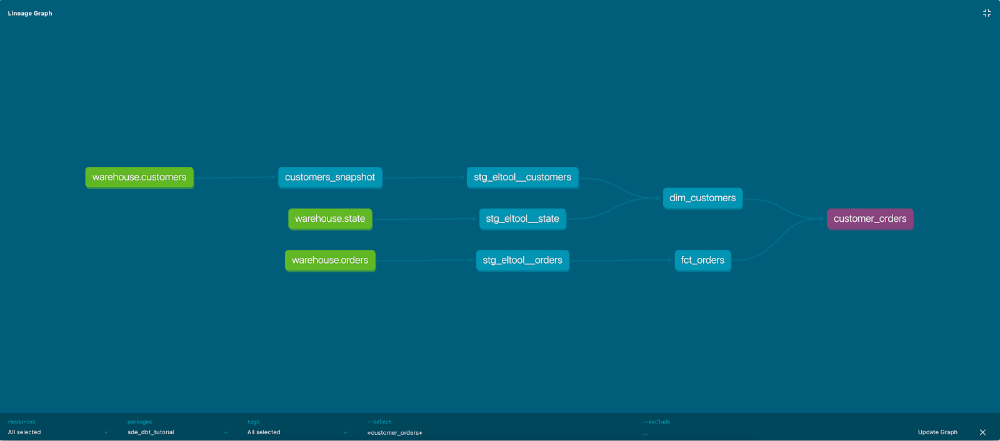
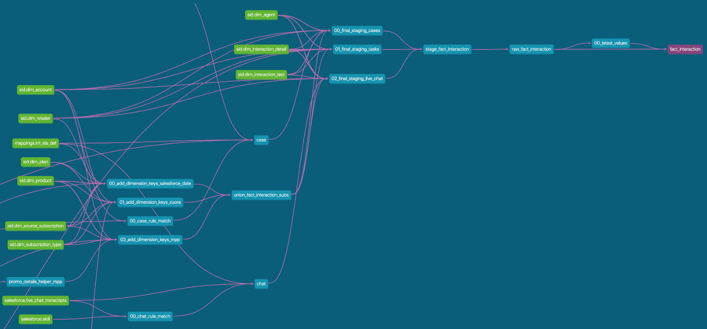

# dbt

<style>
.borderless td, th {
    border: none!important;
}
</style>

## Overview

### Background

* Completely free and open-source software
* Created and maintained by "Fishtown Analytics" AKA "dbt Labs"
* The maintainers also offer a data hosting and orchestration solution,
but that is not a free service and we are not going to cover that
* They released the FOSS software back in 2016
* 5.3k GitHub stars (as of August 2022)
* Renown for bringing software-engineering best practices to data analysts
    * Gave birth to the "analytics engineer" profession
* Simple enough that someone could write it themselves




### Approach

:::{list-table}
:class: borderless

* -
      * It's a lightweight framework that builds on top of SQL
      * Frameworks expect the user to follow a predefined workflow
      * dbt deals with the "T" in ETL -- transform:
      * It expects users to write SQL files in certain folders
      * Because of this, there's very little commitment or vendor lock-in
      * Users can easily opt out of the framework whenever they want to,
      without having to worry about migrating any of their existing scripts
      * The framework is also completely configurable
  - 
:::



## Problems With Traditional RDBMS & Data Warehousing

### RDBMS Problem 1: Documentation

> "Now is better than never
>
> Although never is often better than _right_ now"
>
> -- Zen of Python


:::{list-table}
:header-rows: 1
:class: borderless

* - __Why You Need It__
  - __Why You Can't Have It__
* - 
      * Faster onboarding
      * Mitigate technical debt
      * Enforce coding standard
      * Explain business requirements behind the code
      * Keep track of table dependencies
      * Keep track of overarching data model (star schema, snowflake schema)
  -
      * Too burdensome to create and maintain
      * Existing documentation is rarely satisfactory
      * Documentation is largely decoupled from the RDBMS
      <br>
      <br>
      <br>
      <br>
:::

<h4 style="text-align: center;">dbt Solution 1: Automated Documentation</h4>



* Not everything can be automated
* Lessens the burden on the team
* Allows the team to focus on critical, business-related documentation
* dbt solution:
    * Documentation is no longer decoupled from the SQL files
    * Automatically creates dependency graph for tables
    * Renders README.md files in project into a searchable, indexed webpage

### RDBMS Problem 2: Modularity

> "If the implementation is hard to explain, it's a bad idea"
>
> -- Zen of Python



:::{list-table}
:header-rows: 1
:class: borderless

* - __Why You Need It__
  - __Why You Can't Have It__
* -
    * Maintainable
    * Reusable -- code that can be used by multiple developers
    frees them from having to rewrite and retest common logic
    * Declarative -- code that says what it does and does what it says
    * Testable -- tests are a form of "living documentation"
    and the only guarantee that code does what it's supposed to
    <br>
    <br>
    <br>
    <br>
    <br>
    <br>
    <br>
    <br>
    <br>
  - 
    * The concept does not exist in RDBMS
    * Example:
        * There is a subquery that is used by multiple tables
        * This subquery is copy-pasted in multiple scripts accross many folders
        * What happens when the subquery must be changed?
        * If it's been copied to 20 other places, there are now 20 places that must
	be changed as well
        * Alternatively, create a temp table in database, but this will
	pollute the data model, especially when multiple users are creating temp
	tables everywhere, and even more so when people start doing exploratory
	analysis
:::


<h4 style="text-align: center;">dbt Solution 2: References</h4>



* Queries can be referenced by other queries
* Allows for a modular project setup
* Dependencies between tables become obvious
* Data model is always kept at the forefront during development

### RDBMS Problem 3: Validation

> In the face of ambiguity, refuse the temptation to guess
>
> -- Zen of Python

:::{list-table}
:header-rows: 1
:class: borderless

* - __Why You Need It__
  - __Why You Can't Have It__
* -
    * Data changes unpredictably
    * Business requirements change
    * Fail fast!
        * Write systems to fail elegently
        * Return descriptive error messages
    * CI/CD pipelines are built off of smart validations
  - 
    * RDBMS only exposes the concept of tables to the user
    * There is no concept of a pipeline
    * CRUD either happens, or there is an error that must be debugged
    * DDL is tedious to create and cumbersome to change, and it's not platform
    agnostic
:::

<h4 style="text-align: center;">dbt Solution 3: Validations</h4>



* Validations are straightforward to define
* Can be changed easily and version controlled
* Allow the developer to keep the data pipeline in mind, and not get stuck
thinking only of tables and views
* Refactoring when business logic changes, or data changes, becomes
much more painless

## Inputs & Outputs: Or, What dbt Really Asks of You

### Inputs

#### 1. Python & pip

```shell
pip install dbt-core
```
#### 2. A project namespace, and folders

```
├── .gitignore
├── dbt_project.yml               <-- dbt config file
├── LICENSE
├── tests                         <-- folder to define validations
├── models                        <-- folder to keep SQL files
│   ├── customers.sql
│   ├── docs.md
│   ├── orders.sql
│   ├── overview.md
│   ├── schema.yml
│   └── staging                   <-- base tables
│       ├── schema.yml
│       ├── stg_customers.sql
│       ├── stg_orders.sql
│       └── stg_payments.sql
└── README.md
```
* Models directory contains SQL files that represent tables or views in
the data warehouse
* Models folder also contains a staging folder, the SQL files here
represent base tables that the final, transformed tables are built from
* dbt\_project.yml is where dbt configurations are defined
* Documentation lives with the code
* Validations can be defined in schema.yml or in the tests directory
* _From here on out, a "model" refers to an SQL file in the models folder, or
any of its folders like staging_

#### 3. Materializations

* Each model must declare how it will materialize in the data warehouse
* There are four kinds of materializations:

:::{list-table}
:header-rows: 1
:class: borderless

* - __Table__
  - __View__
  - __Incremental__
  - __Ephemeral__
* -
    * Tables are rebuilt on each run via a `CREATE TABLE` DDL statement
    * Good for any model that will be queried by BI tools
    <br><br><br><br><br><br><br><br><br><br>
    
  - 
    * Synonymous with running a `CREATE VIEW` DDL statement
    * Views are good for final output tables
    <br><br><br><br><br><br><br><br><br><br><br>
  - 
    * Best used for event-style data
    * Tables that are updated periodically with new data
    <br><br><br><br><br><br><br><br><br><br><br>
  - 
    * Great for saving exploratory analysis
    * These are not saved in the data warehouse, so they don't clutter
    the data model
    * They still show up in documentation and the dependency graph, so ad hoc
    work is not lost and can be reused later
    <br><br>
:::

#### 4. Referencing Queries from Queries

* dbt uses the popular templating language known as Jinja
* dbt leverages Jinja to bring programming constructs into SQL
    * control structures (e.g. `if` statements and `for` loops)
    * declare variables
    * send environment variables for production runs
    * define functions without being locked into a particular SQL flavor
* A special Jinja macro is used to reference queries, which enables modularity
    * `{{ ref() }}`
    * (Jinja expressions are enclosed in double curly braces)
    * An example of referencing a base query from another query: `SELECT * FROM {{ ref('model_a') }};`

* Use of Jinja can be regulated by the organization/team by establishing
coding standards
* _Jinja can be easily stripped out of SQL files, so there is no vendor lock-in;
Jinja is also a FOSS used everywhere (especially by Django and Flask)_

#### 5. Defining Validations

* Column validations can be input into a version-controlled schemas.yml file

```yaml
version: 2

models:
  - name: orders
    columns:
      - name: order_id
        tests:
          - unique
          - not_null
      - name: status
        tests:
          - accepted_values:
              values: ['placed', 'shipped', 'completed', 'returned']
      - name: customer_id
        tests:
          - relationships:
              to: ref('customers')
              field: id
```
* Validations can also be simple SQL scripts that live in the tests directory
* These SQL files contain one SELECT clause, and it should select rows
that should not be in the table
* If the query returns rows, dbt will consider that the test has failed

```sql
-- assert_total_payment_amount_is_positive.sql
-- Refunds have a negative amount, so the total amount should always be >= 0.
-- Therefore return records where this isn't true to make the test fail
SELECT
    order_id,
    SUM(amount) as total_amount
FROM {{ ref('fct_payments' )}}
GROUP BY 1
HAVING NOT(total_amount >= 0)
```
* Once tests have been written, issue `dbt test` to validate data
in the data warehouse

#### 6. Run

```shell
dbt run
```

### Outputs

#### 1. An Organized, Platform Agnostic Data Warehouse
* Achieved with nothing but plain and simple SQL
* DDL does not have to be written
* SQL files are now modular and code is not recreated in nested subqueries
* Data movement happens with a simple `dbt run` command
* Any orchestrator of choice (IICS, ADF, Apache Airflow) can be used
    * Plug and play
    * Simply schedule when to run the transformations
    * Logic remains in SQL files

#### 2. Dependency Graph




#### 3. Documentation Website
* `dbt docs generate`
* [Link to Example Documentation Webpage](https://www.getdbt.com/mrr-playbook/#!/overview)

#### 4. Setup for Future CI/CD Pipeline
* A CI/CD pipeline is built on tests and validations
* When a developer makes changes to the source code and attempts to merge
their changes with the central repo, the pipeline will first run the
tests to make sure their changes have not compromised the integrity of the
warehouse

## Final Thoughts & Questions

Good code, code that is version controlled, well-documented, modular, and testable,
becomes -- at once -- the implementation and the documentation
of an enterprise process.
That is something no low-code/no-code platform will ever be able to achieve.
dbt is not an orchestrator, but for our group, it will automate most of our
workload to a simple `dbt run` command.

> Beautiful is better than ugly.
>
> Explicit is better than implicit.
>
> Simple is better than complex.
>
> Complex is better than complicated.
>
> Flat is better than nested.
>
> Sparse is better than dense.
>
> Readability counts.
>
> There should be one-- and preferably only one --obvious way to do it.
>
> -- Zen of Python

